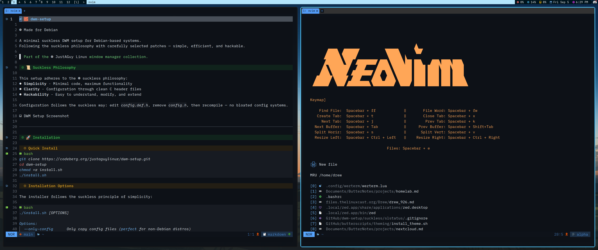

# 🧠 JustAGuy Linux Neovim Config


> Minimal, fast, and intuitive Neovim setup — designed for Markdown writing, scripting, and everyday editing without unnecessary bloat.

This is my personal Neovim configuration — focused on startup speed, clean visuals, and distraction-free editing.  
No LSPs. No heavy language tooling. Just a rock-solid, keyboard-first workflow with sensible plugins and optional Markdown enhancements.

---



---

## ✨ Features

- ⚡ Fast startup via a lightweight custom plugin manager (`manage.lua`)
- 📁 Buffer-based file explorer (`oil.nvim`)
- 🔍 Fuzzy finding with `fzf-lua` 
- 🧠 Smart syntax highlighting via Treesitter
- 🎨 GitHub-inspired theme
- 🖋️ Markdown support with optional Prettier formatting
- 🔐 Git integration with `vim-fugitive`
- 📦 Modular plugin structure
- ⌨️ Keybinding discovery with `which-key.nvim`

---

## 🧩 Plugin Highlights

| Plugin                   | Purpose                                 |
|--------------------------|-----------------------------------------|
| `alpha-nvim`             | Dashboard on launch                     |
| `bufferline.nvim`        | Tab-style buffer UI                     |
| `lualine.nvim`           | Statusline customization                |
| `fzf-lua`                | Fast fuzzy finder (files, words, etc.)  |
| `oil.nvim`               | File browser using buffers              |
| `nvim-treesitter`        | Syntax parsing for multiple filetypes   |
| `vim-fugitive`           | Git integration                         |
| `github-nvim-theme`      | GitHub-style colorscheme                |
| `transparent.nvim`       | Toggle background transparency          |
| `nvim-colorizer.lua`     | Inline hex/rgb color preview            |
| `indent-blankline.nvim`  | Indentation guides                      |
| `markdown-preview.nvim`  | Live Markdown preview in browser        |
| `render-markdown.nvim`   | Inline Markdown rendering in Neovim     |
| `nvim-autopairs`         | Auto-close brackets, quotes, etc.       |
| `autolist.nvim`          | Auto-continue Markdown lists (optional) |
| `which-key.nvim`         | Keybinding discovery and help           |

---

## 🚀 Installation

> **Requires Neovim 0.10+**
> Debian 13 (Trixie) ships with 0.10.4 which works, but `neovim-latest` from [ButterRepo](https://codeberg.org/justaguylinux/butterrepo) provides 0.11.6 with additional features.

### Quick Install (Recommended)

Use the buttervim installer from [ButterScripts](https://codeberg.org/justaguylinux/butterscripts):

```bash
git clone https://codeberg.org/justaguylinux/butterscripts.git
cd butterscripts/neovim
./buttervim.sh
```

This will:
- Add [ButterRepo](https://codeberg.org/justaguylinux/butterrepo) to your apt sources
- Install `neovim-latest` (latest stable Neovim)
- Backup any existing config
- Set up this configuration

Launch with `nvim` - plugins install automatically on first launch.

---

### Manual Install

If you prefer to do it yourself:

```bash
# 1. Add ButterRepo (provides neovim-latest)
curl -fsSL https://justaguylinux.codeberg.page/butterrepo/key.asc | sudo gpg --dearmor -o /usr/share/keyrings/butterrepo.gpg
echo "deb [arch=amd64 signed-by=/usr/share/keyrings/butterrepo.gpg] https://justaguylinux.codeberg.page/butterrepo stable main" | sudo tee /etc/apt/sources.list.d/butterrepo.list
sudo apt update && sudo apt install neovim-latest

# 2. Backup existing config (if any)
mv ~/.config/nvim ~/.config/nvim.backup

# 3. Clone this config
git clone https://codeberg.org/justaguylinux/nvim ~/.config/nvim

# 4. Launch - plugins auto-install
nvim
```

---

## ⌨️ Keybinding Cheatsheet

> `<leader>` is `Space`. All keybindings live in `lua/config/keybinds.lua`.

### General

| Action               | Keybinding         | Description                          |
|----------------------|--------------------|--------------------------------------|
| Select all           | `<leader>a`        | Select entire buffer                 |
| Indent left          | `<` (visual)       | Indent left and stay in visual mode  |
| Indent right         | `>` (visual)       | Indent right and stay in visual mode |
| Dashboard            | `<leader>m`        | Open Alpha dashboard                 |

### Tabs

| Action               | Keybinding         | Description                          |
|----------------------|--------------------|--------------------------------------|
| New tab              | `<leader>t`        | Create new tab                       |
| Close tab            | `<leader>x`        | Close current tab                    |
| Next tab             | `<leader>j`        | Tab forward                          |
| Previous tab         | `<leader>k`        | Tab backward                         |

### Buffers

| Action               | Keybinding         | Description                          |
|----------------------|--------------------|--------------------------------------|
| Next buffer          | `<Tab>`            | Buffer forward                       |
| Previous buffer      | `<S-Tab>`          | Buffer backward                      |
| Close buffer         | `<leader>q`        | Close current buffer                 |

### Splits

| Action               | Keybinding         | Description                          |
|----------------------|--------------------|--------------------------------------|
| Vertical split       | `<leader>v`        | Open vertical split                  |
| Horizontal split     | `<leader>s`        | Open horizontal split                |
| Resize splits        | `<C-Left/Right>`   | Adjust vertical split width          |

### File Navigation

| Action               | Keybinding         | Description                          |
|----------------------|--------------------|--------------------------------------|
| File explorer        | `<leader>e`        | Open `oil.nvim` float                |
| Find file            | `<leader>ff`       | Fuzzy file search                    |
| Live grep            | `<leader>fw`       | Grep for word/project search         |
| Find help            | `<leader>fh`       | Search help tags                     |
| Find config          | `<leader>fc`       | Search files in Neovim config dir    |

### Git

| Action               | Keybinding         | Description                          |
|----------------------|--------------------|--------------------------------------|
| Git status           | `<leader>gg`       | Open fugitive Git status             |
| Git branches         | `<leader>gc`       | Browse and switch branches           |

### Markdown

| Action               | Keybinding         | Description                          |
|----------------------|--------------------|--------------------------------------|
| Markdown preview     | `<leader>pp`       | Toggle browser preview               |
| Prettier format      | `<leader>pf`       | Format with Prettier (optional)      |

---

## 🛠 Requirements

- [`ripgrep`](https://github.com/BurntSushi/ripgrep) (`apt install ripgrep`)
- [`fd`](https://github.com/sharkdp/fd) (`apt install fd-find`)
- A **Nerd Font** terminal (for icons and symbols)

---

## 📝 Optional: Markdown Formatting with Prettier

This config includes optional support for formatting Markdown files using [Prettier](https://prettier.io).

### ✨ Benefits:
- Cleans up messy tables
- Aligns list spacing
- Beautifies headers, paragraphs, and spacing

### 💡 Usage:
1. Install Prettier globally:

   ```bash
   npm install -g prettier
   ```

2. Press `<leader>pf` in any `.md` file to format it.

If Prettier is missing, a friendly error message will be shown in Neovim.

> Prettier is optional — this config works great without it, but it's a nice tool for polished Markdown.

---

## 🌐 Browser Preview for Markdown

To preview a Markdown file in your browser, press `<leader>pp` in any Markdown file.

To set a specific browser, add this to `after/plugin/editing.lua`:

```lua
vim.g.mkdp_browser = "firefox" -- or "thorium-browser", "librewolf", etc.
```

---

## 📁 Directory Layout

```text
nvim/
├── init.lua               → Entry point
├── lua/
│   ├── config/
│   │   ├── keybinds.lua   → Key mappings
│   │   └── options.lua    → Editor options
│   ├── manage.lua         → Custom plugin manager
│   └── plugin-list.lua    → Plugin definitions
├── after/plugin/          → Plugin configurations
│   ├── editing.lua
│   ├── navigation.lua
│   ├── treesitter.lua
│   └── ui.lua
└── screenshots/
```

---

## 🙏 Credits

This config is based on [tonybanters/nvim](https://github.com/tonybanters/nvim), which provided the foundation including:
- The lightweight plugin manager (`manage.lua`) — a clever lazy.nvim alternative
- The modular directory structure
- The plugin-list approach

---

## License

GPL-2.0 - See [LICENSE](LICENSE) for details.

## Support

<a href="https://www.buymeacoffee.com/justaguylinux" target="_blank"></a>

## Connect

- [YouTube](https://youtube.com/@justaguylinux)
- [Codeberg](https://codeberg.org/justaguylinux)
- [Discourse](https://lab.justaguylinux.com)
- [Matrix](https://matrix.to/#/#justaguylinux:matrix.org)
- [Wiki](https://justaguy.wiki)
- [Mastodon](https://fosstodon.org/@justaguylinux)

---

Made with butter by JustAGuyLinux
